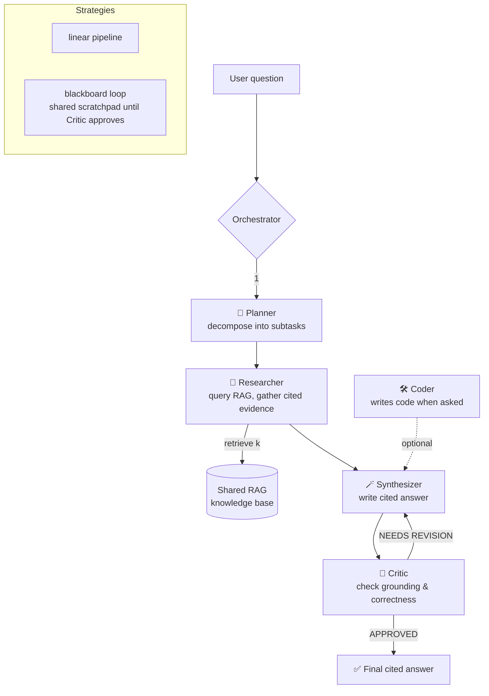

<div align="center">

# ◐ orchestra-rag

### Multi-agent orchestration, grounded by a shared RAG knowledge base.

[](https://github.com/OCT0PUSPR/orchestra-rag/actions/workflows/ci.yml)
[](https://www.python.org/)
[](LICENSE)
[](#llm-backends)
[](#quickstart)
[](https://github.com/astral-sh/ruff)

</div>

---

**orchestra-rag** is a small, professional, end-to-end system that pairs a real
**retrieval-augmented-generation pipeline** with a team of **specialized agents**
— a Planner, a Researcher, a Coder, a Critic, and a Synthesizer — coordinated by
an **orchestrator**. The agents share one grounded knowledge base, collaborate
under one of two coordination strategies, and produce a final answer with
**inline citations** that link back to the exact source chunks.

Everything runs **fully offline** out of the box: a bundled `MockLLM` and a
deterministic hashing embedder mean the *whole* system — ingest → retrieve →
multi-agent answer — works in tests and the demo with **no API key and no
network**. Swap in Anthropic Claude or a Hugging Face model with one config flag.

> The corpus is a fictional company, **Nimbus Robotics**, so retrieval returns
> real, checkable, grounded answers even with zero external dependencies.

---

## Features

- 🧠 **From-scratch retrieval ML** — a hand-written Transformer **bi-encoder**
  (InfoNCE/in-batch negatives), a **cross-encoder reranker**, a from-scratch
  **HNSW** index, and Okapi **BM25** — no `sentence-transformers`/`faiss`. Trained
  on real MS-MARCO, with a reproducible recall@10 / nDCG@10 eval. (`orchestra/ml`)
- 🧩 **Real multi-agent orchestration** — Planner → Researcher → Synthesizer →
  Critic with revise loops, *plus* a blackboard/shared-scratchpad strategy.
- 📚 **Real RAG pipeline** — loaders (`.txt/.md/.html/.pdf`) → overlapping
  chunker → embeddings → vector index → BM25 + RRF hybrid → rerank → cited context.
- 🔌 **Interchangeable backends** behind one `LLMBackend` protocol —
  `MockLLM` (offline), Anthropic Claude (primary), Hugging Face (secondary).
- 🧮 **Zero-heavy-deps RAG** — a deterministic `HashingEmbedder` + a numpy
  cosine-similarity store make retrieval genuinely work without `torch`.
  Optional `sentence-transformers` + `chromadb` are guarded imports.
- 🖥️ **Three surfaces** — a `rich` CLI, a FastAPI server with **SSE streaming**,
  and a **dark web UI** that shows the agents collaborating live.
- 🔗 **Citations that link back** — every claim carries an `[n]` marker; clicking
  it in the UI flashes the source chunk.
- ✅ **Offline test suite** — chunking, embedder determinism, store ranking,
  pipeline retrieval, and a full orchestrator run — no API key, no network.

---

## Architecture

### RAG pipeline

```mermaid
flowchart LR
    A[Documents<br/>.txt .md .html .pdf] --> B[Loaders]
    B --> C[Chunker<br/>overlapping windows]
    C --> D[Embedder<br/>from-scratch bi-encoder &#124; Hashing]
    D --> E[(Vector index<br/>from-scratch HNSW &#124; Numpy)]
    C --> S[(BM25 sparse index)]
    Q[User query] --> D2[Embed query]
    D2 --> E
    Q --> S
    E --> RRF[RRF hybrid fusion]
    S --> RRF
    RRF --> RR[Cross-encoder reranker<br/>from-scratch]
    RR --> F[Top-k passages]
    F --> G[build_context<br/>numbered + cited]
    G --> H[Grounded context<br/>for the agents]
```



### Multi-agent orchestration graph



Two coordination strategies ship in the box:

- **`linear`** — a fixed pipeline that loops Synthesizer ↔ Critic until the
  Critic approves or `max_rounds` is hit.
- **`blackboard`** — every agent reads and writes a shared scratchpad; the loop
  continues until the Critic approves or `max_rounds` is reached.

Both emit structured events that stream to the CLI and the web UI.

---

## From-scratch retrieval models (`orchestra/ml`)

The retrieval **models and indexes are implemented from scratch** — no
`sentence-transformers`, no `transformers`, no `faiss`/`hnswlib`. We use the
`tokenizers` library for the **BPE algorithm only** (merge training + byte-level
pre-tokenizer); everything else is hand-written in PyTorch + numpy:

- **Bi-encoder** — a small Transformer encoder (own multi-head attention, blocks,
  mean-pooling) producing L2-normalized embeddings, trained with **InfoNCE /
  in-batch negatives** on `(query, positive-passage)` pairs.
- **Cross-encoder reranker** — a Transformer that jointly scores
  `[CLS] query [SEP] passage [SEP]`, trained with BCE on hard negatives (the gold
  BM25 negatives from MS-MARCO plus extra negatives mined by the bi-encoder).
- **HNSW index** — a from-scratch hierarchical navigable small-world graph
  (insertion with `ef_construction` beam search + neighbour pruning; `ef`/greedy
  search). ~1.0 recall@10 vs brute force on a few-thousand-vector pool.
- **BM25** — Okapi BM25 over a pure-Python inverted index.

Training data is real **MS-MARCO BM25 triplets** (auto-downloaded + cached) plus
synthetic pairs from the bundled corpus (so it also trains fully offline). The
trainer auto-selects **MPS > CUDA > CPU**, uses AdamW with warmup + cosine decay,
checkpoints the best model, and exports the bi-encoder to **ONNX** (verified
against PyTorch, max abs diff ~1e-7).

### Train it (laptop, ~3 min on Apple MPS)

```bash
pip install -r requirements-min.txt -r requirements-train.txt
python scripts/train_ml.py            # downloads MS-MARCO slice, trains, evals, exports ONNX
```

This writes tiny proof checkpoints (<25 MB total) to `orchestra/ml/checkpoints/`,
which are then picked up **automatically** as the default embedder + vector index
+ reranker (the `HashingEmbedder` + `NumpyStore` remain the zero-dep fallback).

### Real measured results

Held-out evaluation over a **7,655-passage MS-MARCO pool** with **600 held-out
queries** (each with one known-relevant passage), from tiny models trained for a
few minutes on an Apple-MPS laptop. These are the **actual measured numbers**
(reproduce with `python scripts/eval_report.py`), reported honestly — including
where the small reranker does *not* help:

<!-- ML-EVAL-TABLE -->
| System (all from scratch)             | recall@10 | nDCG@10 |
| ------------------------------------- | --------- | ------- |
| BM25 (sparse)                         | **0.880** | **0.551** |
| Hybrid — RRF(BM25, bi-encoder)        | 0.713     | 0.408   |
| Bi-encoder (dense)                    | 0.147     | 0.092   |
| Bi-encoder + cross-encoder rerank     | 0.055     | 0.023   |
<!-- /ML-EVAL-TABLE -->

What these numbers honestly show, and why:

- **BM25 dominates this particular benchmark** because the MS-MARCO *BM25-triplet*
  slice we train/eval on selects positives that are, by construction, lexically
  retrievable — so a strong lexical scorer is hard to beat. The from-scratch BM25
  works exactly as intended.
- **The bi-encoder learns real semantics** (it retrieves the relevant passage on
  in-domain corpus questions at **recall@4 ≈ 0.70** — see the RAG eval harness),
  but at ~2.3 M parameters / a few minutes of training it is well below BM25 on
  this hard, lexically-biased 7.6 K-passage set. That gap is a *scale* story, not
  a *correctness* story — see [Scaling up](#scaling-up-gpu--colab).
- **The tiny cross-encoder reranker does not yet beat its first stage.** It trains
  and converges (≈0.79 pairwise accuracy on held-out training-distribution pairs)
  and is correctly wired + ONNX-adjacent, but a 2.3 M-param model with an 8 K BPE
  vocab does not produce well-calibrated *ranking* scores that generalize to
  unseen queries — so reranking the top-50 reshuffles them worse. We report this
  rather than hide it. Rerankers of this kind need the GPU scale-up (more params,
  more data, more steps) to pay off; the script and notes are below.

The HNSW index, separately, matches brute-force at **~1.0 recall@10** on a few-
thousand-vector pool (`tests/test_ml.py::test_hnsw_recall_matches_bruteforce`) and
the bi-encoder ONNX export matches PyTorch to **~1e-7**.

> The point of this layer is a faithful **from-scratch** implementation with an
> **honest, reproducible** evaluation — not a leaderboard score. To scale up on a
> GPU (bigger model, full MS-MARCO), see [Scaling up](#scaling-up-gpu--colab).

### Scaling up (GPU / Colab)

`scripts/scale_up_colab.py` runs the **same** from-scratch architecture, larger:

```bash
# Colab / cloud GPU
!pip install -r requirements-min.txt -r requirements-train.txt
!python scripts/scale_up_colab.py --msmarco-limit 50000 --epochs 10 \
    --dim 384 --depth 6 --heads 6 --batch-size 256
```

The bigger checkpoints drop into the same path and are used automatically by the
RAG stack. In-batch InfoNCE quality scales with batch size (more negatives), so
raise `--batch-size` as far as GPU memory allows.

---

## Quickstart

No API key required — the default backend is the offline `MockLLM`.

```bash
# 1. Clone and enter
git clone https://github.com/OCT0PUSPR/orchestra-rag.git
cd orchestra-rag

# 2. Lightweight install (no torch / no chromadb) — enough for everything offline
python -m venv .venv && source .venv/bin/activate
pip install -r requirements-min.txt
pip install -e .

# 3. Run the canned offline demo (ingest -> multi-agent -> cited answers)
orchestra demo

# 4. Ask your own question (auto-ingests the bundled corpus on first run)
orchestra ask "How long does the Atlas-7 battery last and how fast can it swap?"

# 5. Run the test suite — fully offline
pytest -q
```

Want real embeddings and Claude answers?

```bash
pip install -r requirements.txt          # adds sentence-transformers, chromadb, torch
export ANTHROPIC_API_KEY=sk-ant-...       # never hardcode keys; env vars only
orchestra ask "Explain Conductor's traffic management" --backend anthropic
```

---

## Usage

### CLI

```bash
# Ingest documents (files or directories) into the knowledge base
orchestra ingest data/sample_corpus
orchestra ingest ./my_docs/handbook.pdf ./my_docs/notes.md

# Ask — streams the live agent collaboration, then prints the cited answer
orchestra ask "What languages are approved for production?" --backend mock
orchestra ask "How does Conductor prevent collisions?" --strategy blackboard --k 5

# Canned multi-question offline demo
orchestra demo
```

### Web UI + API server

```bash
uvicorn orchestra.api.server:app --reload --port 8000
# open http://localhost:8000
```

The dark UI lets you upload docs to build the KB, ask a question, and watch the
Planner / Researcher / Synthesizer / Critic collaborate live in a timeline, with
the final answer showing clickable inline citations.

### API endpoints

| Method | Path            | Description                                              |
| ------ | --------------- | ------------------------------------------------------- |
| `GET`  | `/`             | Serves the web UI                                       |
| `GET`  | `/health`       | Liveness + knowledge-base size                          |
| `POST` | `/ingest`       | Upload docs (multipart `files`) to build the KB         |
| `POST` | `/ingest/paths` | Ingest server-side paths (`{"paths": [...]}`)           |
| `POST` | `/ask`          | **SSE stream** of the collaboration + final cited answer |

```bash
# Health
curl localhost:8000/health

# Ask over SSE (streams agent events as they happen)
curl -N -X POST localhost:8000/ask \
  -H 'Content-Type: application/json' \
  -d '{"question": "How much parental leave do employees get?", "backend": "mock"}'
```

### Python

```python
from pathlib import Path
from orchestra.rag.pipeline import RAGPipeline
from orchestra.llm import MockLLM
from orchestra.orchestrator import Orchestrator

rag = RAGPipeline()                       # auto-picks an embedder + numpy store
rag.ingest(Path("data/sample_corpus"))

orch = Orchestrator(MockLLM(), rag, strategy="linear", k=4, max_rounds=3)
result = orch.run("How fast can the Atlas-7 swap its battery?")

print(result.answer)                      # cited answer
for c in result.citations():
    print(c["n"], c["source"], c["text"][:60])
```

### Docker

```bash
docker compose up app                     # API + UI at http://localhost:8000
docker compose run --rm app orchestra demo
docker compose --profile chroma up        # also start a standalone chroma server
```

---

## How to add an agent role

Adding a specialist is three small steps:

1. **Subclass `Agent`** in `orchestra/agents/roles.py` with a role id and a
   system prompt:

   ```python
   from orchestra.agents.base import Agent, AgentResult

   class FactCheckerAgent(Agent):
       role = "factchecker"

       def default_system_prompt(self) -> str:
           return (
               "You are the Fact-Checker. Verify each claim in the DRAFT against "
               "the numbered CONTEXT and flag any unsupported statement."
           )

       def run(self, task, *, scratchpad=None, draft="", passages=None):
           from orchestra.rag.pipeline import RAGPipeline
           context = RAGPipeline.build_context(passages or [])
           content = self.complete(f"QUESTION: {task}\n\nDRAFT:\n{draft}\n\nCONTEXT:\n{context}")
           return AgentResult(role=self.role, content=content, passages=passages or [])
   ```

2. **Register it** in `build_default_agents(...)` (same file) so the
   orchestrator can find it by name.

3. **Wire it into a strategy** in `orchestra/orchestrator.py` — emit
   `agent_start` / `agent_message` events around its `run(...)` call so the CLI
   and web UI render it automatically (the UI even picks a colour by role name;
   add one in `web/style.css` if you like).

The `MockLLM` keys off the `ROLE:` marker in the system prompt — give your new
role a branch in `orchestra/llm.py` if you want offline behaviour for it too.

---

## Configuration

All settings are env-driven (prefix `OARAG_`) via `pydantic-settings`, with a
`.env` file supported. Copy `.env.example` to `.env`. Secrets are read from the
conventional vars and **never hardcoded**.

| Setting                  | Env var                   | Default              | Notes                                  |
| ------------------------ | ------------------------- | -------------------- | -------------------------------------- |
| LLM backend              | `OARAG_BACKEND`           | `mock`               | `mock` / `anthropic` / `huggingface`   |
| Strategy                 | `OARAG_STRATEGY`          | `linear`             | `linear` / `blackboard`                |
| Retrieved passages       | `OARAG_K`                 | `4`                  | top-k                                  |
| Embedder                 | `OARAG_EMBEDDER`          | `auto`               | `auto` / `hashing` / `ml` / `sentence-transformers` (`auto` prefers the trained from-scratch bi-encoder, then ST, then hashing) |
| Vector store             | `OARAG_STORE`             | `numpy`              | `numpy` / `hnsw` / `chroma` (`auto` uses from-scratch HNSW when a checkpoint is present) |
| Reranker                 | `OARAG_RERANK`            | `false`              | from-scratch cross-encoder when a checkpoint is present, else sentence-transformers, else skipped |
| Chunk size / overlap     | `OARAG_CHUNK_SIZE` / `…_OVERLAP` | `180` / `40`  | words                                  |
| Max critic rounds        | `OARAG_MAX_ROUNDS`        | `3`                  |                                        |
| Per-role models          | `OARAG_{ROLE}_MODEL`      | Claude 4.x ids       | used by anthropic/hf backends          |
| Anthropic key            | `ANTHROPIC_API_KEY`       | —                    | secret                                 |
| Hugging Face token       | `HF_TOKEN`                | —                    | secret                                 |

---

## Project tree

```
orchestra-rag/
├── orchestra/
│   ├── __init__.py
│   ├── config.py              # pydantic-settings (+ a no-dep fallback)
│   ├── llm.py                 # LLMBackend protocol: MockLLM / Anthropic / HuggingFace
│   ├── orchestrator.py        # linear + blackboard strategies, streamed events
│   ├── app.py                 # wires pipeline + orchestrator from settings
│   ├── cli.py                 # `orchestra ingest|ask|demo`
│   ├── rag/
│   │   ├── loaders.py         # .txt/.md/.html/.pdf + directory ingest
│   │   ├── chunking.py        # pure overlapping chunker (unit-tested)
│   │   ├── embeddings.py      # HashingEmbedder + MLEmbedder + guarded STEmbedder
│   │   ├── vectorstore.py     # NumpyStore + HNSWStore + guarded ChromaStore
│   │   ├── sparse.py          # from-scratch Okapi BM25
│   │   ├── hybrid.py          # RRF fusion of dense + sparse
│   │   ├── rerank.py          # MLReranker + guarded CrossEncoder
│   │   └── pipeline.py        # ingest / retrieve / build_context
│   ├── ml/                    # FROM-SCRATCH retrieval ML (torch, import-guarded)
│   │   ├── transformer.py     # own attention/blocks/pooling
│   │   ├── bi_encoder.py      # InfoNCE bi-encoder
│   │   ├── cross_encoder.py   # cross-encoder reranker
│   │   ├── hnsw.py            # from-scratch HNSW index (numpy)
│   │   ├── tokenizer.py       # BPE (via `tokenizers`) wrapper
│   │   ├── data.py            # MS-MARCO + synthetic pairs, hard-neg mining
│   │   ├── train_biencoder.py # InfoNCE training loop
│   │   ├── train_cross.py     # reranker training loop
│   │   ├── eval.py            # recall@k / nDCG@k harness
│   │   ├── adapters.py        # MLEmbedder / MLReranker / HNSWStore
│   │   ├── onnx_export.py     # bi-encoder -> ONNX (+ verify)
│   │   └── checkpoints/       # tiny committed proof weights (<25MB)
│   ├── agents/
│   │   ├── base.py            # Agent (role, prompt, llm, RAG tool)
│   │   └── roles.py           # Planner/Researcher/Coder/Critic/Synthesizer
│   ├── db/ · eval/ · observability.py · security.py · reliability.py · worker.py
│   └── api/
│       ├── server.py          # FastAPI: /ingest /ask(SSE) /health /
│       └── web/               # dark UI: index.html + app.js + style.css
├── scripts/
│   ├── train_ml.py            # end-to-end train + eval + ONNX (laptop)
│   └── scale_up_colab.py      # GPU/Colab scale-up (same architecture)
├── data/sample_corpus/        # 5 original Nimbus Robotics docs
├── tests/                     # offline: chunking, embeddings, store, pipeline, orchestrator, ml
├── requirements.txt           # full (incl. heavy ML)
├── requirements-min.txt       # lightweight (no torch/chroma)
├── requirements-train.txt     # from-scratch ML training (torch/tokenizers/onnx)
├── pyproject.toml
├── ARCHITECTURE.md
├── Dockerfile
├── docker-compose.yml
├── .env.example
└── .github/workflows/ci.yml   # lint + offline pytest
```

---

## LLM backends

| Backend       | Class           | Needs                | When                                   |
| ------------- | --------------- | -------------------- | -------------------------------------- |
| `mock`        | `MockLLM`       | nothing              | offline tests, demos, CI               |
| `anthropic`   | `AnthropicLLM`  | `ANTHROPIC_API_KEY`  | primary — Claude with adaptive thinking |
| `huggingface` | `HuggingFaceLLM`| `HF_TOKEN`           | secondary — open models via Inference API |

All three implement the same `LLMBackend` protocol, so they are drop-in
interchangeable. The `MockLLM` is deliberately *not* a dumb echo: it reads the
role marker and the retrieved context to produce role-appropriate, genuinely
grounded output, including real `[n]` citations for the Synthesizer.

---

## Roadmap

- [x] **Reranking stage (cross-encoder)** between retrieval and synthesis — done,
  from scratch (`orchestra/ml/cross_encoder.py`).
- [x] **Evaluation harness** scoring retrieval (recall@k / nDCG@k) and grounding —
  done (`orchestra/ml/eval.py`, `orchestra/eval/harness.py`).
- [ ] Streaming token-level output from real backends into the UI timeline.
- [ ] Tool-calling Coder that actually executes generated code in a sandbox.
- [ ] Per-conversation memory so follow-up questions reuse prior context.
- [ ] Pluggable strategy registry (debate, tree-of-agents, router).

---

## License

[MIT](LICENSE) © 2026 OCT0PUSPR
